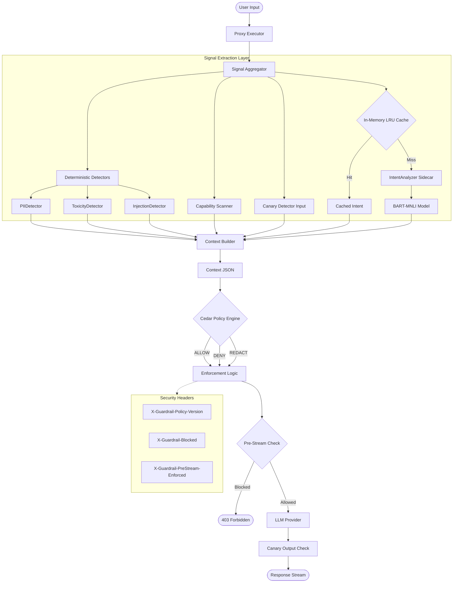

# Agent Guardrail

A transparent proxy layer that sits between your applications and LLM providers, applying configurable guardrails to prevent prompt injection, enforce policies, and ensure safe AI interactions.


## 🚀 Features

- **Prompt Injection Detection** - Blocks attempts to manipulate LLM behavior (22+ regex patterns)
- **PII Detection** - Identifies and blocks SSN, credit cards, email, phone
- **Toxicity Filtering** - Detects weapons, malware, hacking attempts (11+ patterns)
- **Capability Scanner** - Blocks file deletion, privilege escalation commands
- **Intent Classification** - BART-MNLI semantic analysis with confidence scoring
- **Cedar Policy Engine** - Declarative policy decisions with full audit trail
- **Multi-Provider Support** - Groq, OpenAI, Anthropic, and any OpenAI-compatible API

## 📦 Quick Start (Docker)

```bash
# Clone and start all services
git clone https://github.com/blackrose-blackhat/agent-guardrail.git
cd agent-guardrail

# Set your Groq API key (or use the default in docker-compose.yml)
export GROQ_API_KEY=your_key_here

# Start all services
docker-compose up -d

# Test it works
curl -X POST http://localhost:8080/v1/chat/completions \
  -H "Content-Type: application/json" \
  -d '{"model":"llama-3.3-70b-versatile","messages":[{"role":"user","content":"Hello!"}]}'
```

### Services Started

| 8080 | Proxy | Guardrail proxy (main API) |
| 8001 | Intent Analyzer | BART-MNLI intent classification |
| 9090 | Prometheus | Metrics collection |
| 3000 | Grafana | Dashboards (admin/guardrail) |

## 🛠️ Manual Installation (No Docker)

If you prefer running services directly or have issues with Docker, follow these steps.

### Prerequisites
- **Go 1.22+**
- **Python 3.9+**

### 1. Start Intent Analyzer (Python Sidecar)
This service runs the BART-MNLI model for semantic analysis.

```bash
cd services/intent-analyzer
python3 -m venv venv
source venv/bin/activate
pip install -r requirements.txt

# Start the service (runs on port 8001)
export PORT=8001
python3 -m uvicorn main:app --port 8001 --host 0.0.0.0
```

### 2. Start Guardrail Proxy (Go)
This is the main entry point that forwards traffic to Groq/OpenAI.

```bash
# In a new terminal, go to project root
cd agent-guardrail

# Set your API Key (Groq or OpenAI)
export GROQ_API_KEY=gsk_your_key_here
export PROVIDER_URL=https://api.groq.com/openai
export PROVIDER_TYPE=openai
export PROVIDER_KEY=$GROQ_API_KEY

# Configure Sidecar URL
export INTENT_ANALYZER_URL=http://127.0.0.1:8001

# Run the proxy (runs on port 8080)
go run backend/cmd/proxy/main.go
```

### 3. Verify System
Run the included verification suite to confirm everything is working:

```bash
./verification_suite.sh
```

## 🔧 Configuration

### Environment Variables

```bash
# Provider (Groq)
PROVIDER_URL=https://api.groq.com/openai
PROVIDER_TYPE=openai
PROVIDER_KEY=gsk_your_key_here

# Or OpenAI
PROVIDER_URL=https://api.openai.com
PROVIDER_TYPE=openai
PROVIDER_KEY=sk-your_key_here

# Server
SERVER_HOST=0.0.0.0
SERVER_PORT=8080
```

### Available Groq Models

- `llama-3.3-70b-versatile` (recommended)
- `llama-3.1-8b-instant`
- `mixtral-8x7b-32768`

## 📊 Benchmark Results

```
Total:           55 adversarial prompts
Block accuracy:  100.00%
False negatives: 0
False positives: 0
```

## 🏗️ Architecture



## ⚙️ System Specifications (v2.4)

### 1. Intent Classification
- **Model**: `facebook/bart-large-mnli` (Zero-Shot Classification)
- **Deployment**: Local Python Sidecar (MPS/CPU optimized)
- **Latency**: ~300ms (P95) with caching enabled
- **Fallback**: 30ms Fast-Path Heuristics for greetings/exploits

### 2. Signal Extractors
- **PII Detector**: 4 regex patterns (Email, SSN, Credit Card, Phone)
- **Toxicity**: 11 keyword/regex patterns
- **Injection**: 22 adversarial patterns (DAN, Ignore instructions, etc.)
- **Capabilities**: Lexical scan for dangerous system calls (`os.system`, `subprocess`)

### 3. Policy Engine
- **Engine**: Cedar (Policy-as-Code)
- **Granularity**: Role-Aware + Asset Sensitivity
- **Performance**: <2ms evaluation time

## 🔌 Integration Examples

### Python (OpenAI SDK)

```python
from openai import OpenAI

client = OpenAI(
    base_url="http://localhost:8080/v1",
    api_key="your-groq-key"
)

response = client.chat.completions.create(
    model="llama-3.3-70b-versatile",
    messages=[{"role": "user", "content": "Hello!"}]
)
```

### TypeScript

```typescript
import OpenAI from 'openai';

const client = new OpenAI({
  baseURL: 'http://localhost:8080/v1',
  apiKey: 'your-groq-key',
});

const response = await client.chat.completions.create({
  model: 'llama-3.3-70b-versatile',
  messages: [{ role: 'user', content: 'Hello!' }],
});
```

### cURL

```bash
curl -X POST http://localhost:8080/v1/chat/completions \
  -H "Content-Type: application/json" \
  -d '{
    "model": "llama-3.3-70b-versatile",
    "messages": [{"role": "user", "content": "Hello!"}]
  }'
```

## 🔒 Security Headers

| Header | Description |
|--------|-------------|
| `X-Guardrail-Request-ID` | Unique request ID for auditing |
| `X-Guardrail-PreStream-Enforced` | Policy evaluated before streaming |
| `X-Guardrail-Policy-Version` | SHA256 of active policy |

## 🧪 Running Benchmarks

```bash
./tests/benchmark/run_benchmark.sh
```

## 📄 License

MIT License - see [LICENSE](LICENSE) for details.
