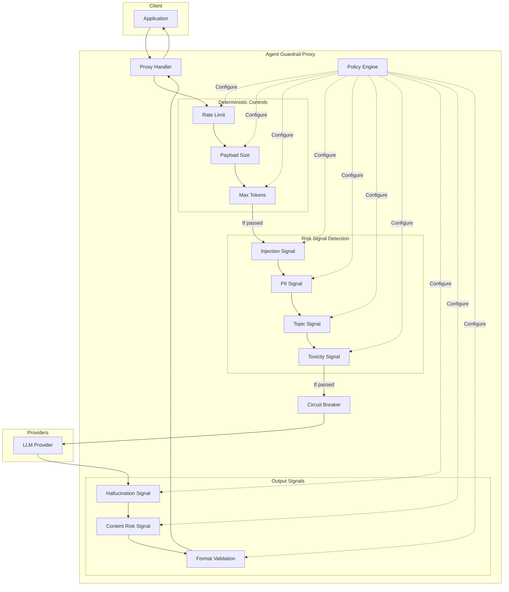

# Agent Guardrail: Project Report & Architecture

> _"A provider-agnostic LLM execution gateway that can intercept, annotate, and conditionally control requests using policy-driven signals."_

---

## 1. What This Is (And What It Is Not)

### ✅ What It Is

- **Execution Control Layer**: A proxy that sits between your app and LLM providers
- **Signal-Based Risk Detection**: Heuristics that flag _potential_ issues (not facts)
- **Deterministic Operational Controls**: Hard limits on rate, size, tokens (no ambiguity)
- **Policy-Driven Configuration**: YAML-based rules without code changes

### ❌ What It Is Not

- **Not "AI Safety"**: We intercept execution, we don't change model behavior
- **Not Foolproof Detection**: Heuristics have false positives/negatives
- **Not a Silver Bullet**: Sophisticated attacks may bypass signature-based detection

---

## 2. Critical Architecture Distinction

```
┌─────────────────────────────────────────────────────────────────────────┐
│                         CONTROL HIERARCHY                                │
├─────────────────────────────────────────────────────────────────────────┤
│  LAYER 1: DETERMINISTIC CONTROLS (Hard Limits - No False Positives)    │
│  ┌─────────────┐ ┌─────────────┐ ┌─────────────┐ ┌─────────────┐       │
│  │ Rate Limit  │ │ Payload Size│ │ Max Tokens  │ │  Timeout    │       │
│  │  (60/min)   │ │  (10MB max) │ │ (8192 max)  │ │ (60s max)   │       │
│  └─────────────┘ └─────────────┘ └─────────────┘ └─────────────┘       │
│  Result: BLOCK or PASS (no "maybe")                                     │
├─────────────────────────────────────────────────────────────────────────┤
│  LAYER 2: SIGNAL-BASED DETECTION (Heuristic - May Have False Positives)│
│  ┌─────────────┐ ┌─────────────┐ ┌─────────────┐ ┌─────────────┐       │
│  │  Injection  │ │ PII Risk    │ │ Topic Risk  │ │ Toxicity    │       │
│  │   Signal    │ │   Signal    │ │   Signal    │ │   Signal    │       │
│  └─────────────┘ └─────────────┘ └─────────────┘ └─────────────┘       │
│  Result: RISK SIGNAL → Policy decides action                           │
├─────────────────────────────────────────────────────────────────────────┤
│  LAYER 3: POLICY DECISION                                               │
│  Signal → Risk Score → Policy Rule → Action (block/redact/warn/log)    │
└─────────────────────────────────────────────────────────────────────────┘
```

---

## 3. Request Flow



---

## 4. Implemented Controls

### Deterministic Controls (Hard Limits)

These provide **operational necessity** - no false positives possible.

| Control           | Type            | Description                        |
| :---------------- | :-------------- | :--------------------------------- |
| `rate_limit`      | Hard Block      | X requests per minute/hour per key |
| `payload_size`    | Hard Block      | Max request size in bytes          |
| `max_tokens`      | Hard Block      | Max estimated input/output tokens  |
| `circuit_breaker` | Controlled Fail | Provider failure handling          |

### Risk Signal Detection (Heuristic)

These flag **potential issues** - policy decides action.

| Signal                 | Detection Method   | Limitation                 |
| :--------------------- | :----------------- | :------------------------- |
| `injection_signal`     | Regex patterns     | Novel attacks may bypass   |
| `pii_risk_signal`      | Regex patterns     | Context-dependent accuracy |
| `topic_risk_signal`    | Keyword clusters   | May miss subtle violations |
| `toxicity_signal`      | Heuristic scoring  | Cultural/context dependent |
| `hallucination_signal` | Indicator patterns | Cannot verify facts        |
| `content_risk_signal`  | Keyword filtering  | Context blind              |

---

## 5. Policy Configuration

### Deterministic Controls (Always Enforced)

```yaml
deterministic_controls:
  rate_limit:
    enabled: true
    requests_per_minute: 60
    requests_per_hour: 1000
  payload_size:
    enabled: true
    max_request_size: 10485760 # 10MB
  max_tokens:
    enabled: true
    max_input_tokens: 8192
```

### Risk Signal Detection (Policy-Driven)

```yaml
guardrails:
  input:
    prompt_injection: # SIGNAL, not fact
      enabled: true
      sensitivity: medium
      action: block # Policy decides
    pii_detection: # SIGNAL, not fact
      enabled: true
      action: redact # Policy decides
```

---

## 6. Response Metadata

Every response includes transparent metadata:

```json
{
  "_guardrail": {
    "request_id": "abc-123",
    "signals": [
      {
        "name": "pii_risk_signal",
        "type": "risk_signal",
        "message": "Potential PII detected",
        "confidence": "heuristic",
        "action_taken": "redact"
      }
    ]
  }
}
```

Headers:

- `X-Guardrail-Request-ID`: Audit trail
- `X-Guardrail-Signals`: Number of signals fired
- `X-Guardrail-Blocked`: Hard block indicator

---

## 7. Implementation Status

### ✅ Complete

| Component                       | Status |
| :------------------------------ | :----- |
| Middleware chain architecture   | Done   |
| YAML policy loader + hot-reload | Done   |
| 4 input signal detectors        | Done   |
| 3 output signal detectors       | Done   |
| 3 deterministic controls        | Done   |
| Circuit breaker pattern         | Done   |
| Multi-provider support          | Done   |

### ⏳ Planned

| Component                              | Priority |
| :------------------------------------- | :------- |
| Signal → Risk Score → Policy hierarchy | High     |
| LLM-as-a-Judge (semantic detection)    | High     |
| Metrics & observability                | Medium   |
| CLI + admin dashboard                  | Medium   |

---

## 8. Intellectual Honesty Note

This system provides **execution control**, not "AI safety."

- **Signal-based detection** uses patterns and heuristics
- **We detect risk indicators, not facts**
- **Policy owners decide actions based on their risk tolerance**
- **Sophisticated attacks may require semantic/LLM-based detection**

The architecture is designed for extensibility. When regex fails, you can plug in an LLM-as-a-Judge without changing the chain.

---

_Created: 2026-02-07_
_Classification: Execution Control Infrastructure_
